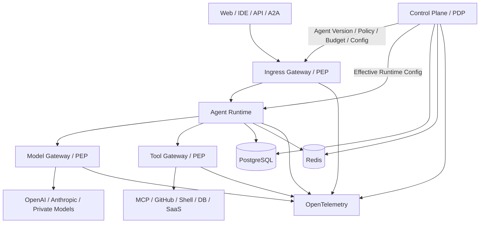
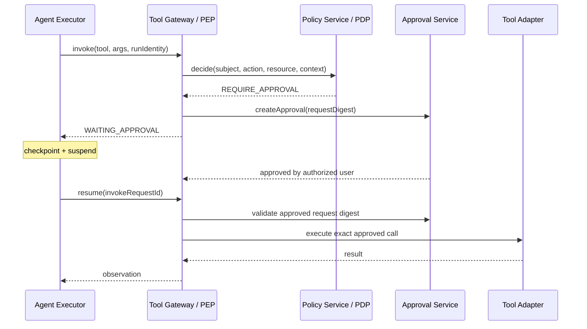

# Architecture — Control Plane + Data Plane + 3 Gateways

## 1. 架构结论

v1 使用：**模块化单体 Control Plane + 独立 Agent Runtime + 逻辑三网关 + 共享基础设施**。

不要在 MVP 阶段拆成十几个微服务。先稳定边界与契约，再按负载、团队和安全边界拆分。



## 2. Control Plane 与 Data Plane

### Control Plane
负责“定义允许发生什么”：
- Workspace / Identity / Membership
- Agent Registry / Version
- Model Policy
- Tool Registry / Tool Policy
- Policy Decision
- Budget
- Approval
- Release / Rollback
- Audit Configuration

### Data Plane
负责“真正执行任务”：
- Ingress enforcement
- Session / Run
- Context
- Agent Loop
- Workflow / DAG
- Model Call
- Tool Call
- Checkpoint
- Runtime Event Stream

关键约束：Data Plane 可以读取有效策略并请求决策，但不能修改策略本身。

## 3. 3 Gateways

### 3.1 Ingress Gateway
职责：认证、Workspace / User / Agent Identity、Rate Limit、请求 Scope、A2A 校验。

MVP 可以作为 Spring Boot Control Plane 的 API 入口模块实现；未来再单独拆 Spring Cloud Gateway / Envoy。

### 3.2 Model Gateway
职责：
- 逻辑模型 → Provider Route
- API Credential Isolation
- Budget Enforcement
- Token Limit
- Timeout / Retry / Fallback
- Usage metering

重要：业务 Agent 代码不得直接调用 Provider SDK。

### 3.3 Tool Gateway
职责：
- Tool lookup
- schema validation
- scope check
- policy enforcement
- approval binding
- timeout / retry policy
- execution audit

所有会产生外部副作用的工具优先纳入 Tool Gateway。

## 4. PDP / PEP

```text
Agent requests action
        ↓
PEP (Gateway)
        ↓
Policy Decision Request
        ↓
PDP (Control Plane)
        ↓
ALLOW | DENY | REQUIRE_APPROVAL
        ↓
PEP 强制执行
```

PDP 负责“决定”；PEP 负责“不可绕过地执行决定”。

## 5. MVP 部署单元

```text
/apps/web-console
/services/control-plane
/services/agent-runtime
/infra/docker-compose
```

Control Plane 内部按领域模块组织，而不是物理微服务。

Agent Runtime 内部建议：

```text
runtime/
├── session
├── run
├── context
├── workflow
├── executor
├── checkpoint
├── model-gateway
├── tool-gateway
└── event-stream
```

## 6. 受控状态迁移

Run 状态：

```text
CREATED
  ↓
RUNNING
  ├─→ WAITING_APPROVAL ─→ RUNNING
  ├─→ PAUSED ──────────→ RUNNING
  ├─→ FAILED
  ├─→ CANCELLED
  └─→ COMPLETED
```

Runtime 不允许任意写 `status`；必须调用状态机命令，例如：
- startRun
- requestApproval
- resumeAfterApproval
- failRun
- completeRun
- cancelRun

每个命令验证合法前态。

## 7. 一次 Tool Call 的完整链路



审批绑定的是**确切 Action Request**，而不是泛化的“这个 Agent 已获批准”。如果参数变化，必须重新决策。

## 8. 数据一致性

### 强一致对象
- Agent Version publish
- Approval status
- Budget reservation / consume
- Release active version
- Run state transition

优先使用 PostgreSQL 事务。

### 最终一致对象
- Metrics
- Search index
- Aggregated usage dashboard
- Long-term analytics

使用 Outbox / background jobs 异步处理。

## 9. 事件模型

核心事件：
- AgentCreated
- AgentVersionPublished
- RunCreated
- RunStarted
- ModelCallCompleted
- ToolCallRequested
- PolicyDecisionMade
- ApprovalRequested
- ApprovalResolved
- ToolCallCompleted
- RunCompleted / RunFailed
- ReleaseActivated / RolledBack

MVP 不要求 Kafka。先用 Postgres Outbox + worker。

## 10. 安全边界

- Provider API Key 只存在于 Model Gateway secret storage。
- Tool credentials 只存在于 Tool Gateway / Connector secret storage。
- Runtime 获取的是 credential reference，而不是 secret 明文。
- Approval token 不进入 Prompt。
- Policy evaluation input 中不接受 Agent 自报角色作为可信身份。
- 每次 Tool Call 使用服务器注入的 `agentId/userId/workspaceId/runId/versionId`。

## 11. 未来拆分条件

只有出现下列情况才拆微服务：
- Model Gateway QPS 与 Runtime 明显不同。
- Tool Gateway 需要独立网络安全域。
- Approval / Policy 需要独立高可用和团队 ownership。
- Control Plane 单体发布频率成为瓶颈。
- 数据归属要求服务级隔离。

在此之前，保持模块化单体更容易保证事务和迭代速度。
