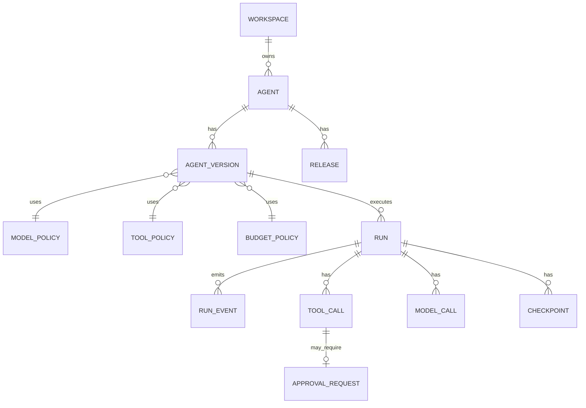

# Data Model — MVP

## 1. 原则

- PostgreSQL 是控制状态的事实源。
- Redis 只存短期缓存、锁、SSE fanout 等可重建数据。
- Published Version、Approval、Run State、Budget 不能只存在 Redis。
- 使用 UUID / UUIDv7 或 ULID 作为全局 ID。

## 2. 核心关系

## 3. 主要表

### workspace
- id
- name
- status
- created_at

### agent
- id
- workspace_id
- name
- description
- status
- current_published_version_id
- created_at / updated_at

### agent_version
- id
- agent_id
- version_number
- state
- instructions
- runtime_profile_json
- model_policy_id
- tool_policy_id
- budget_policy_id
- approval_policy_id
- checksum
- published_at
- created_at

唯一约束：`(agent_id, version_number)`。

### model_policy
- id
- workspace_id
- name
- config_json
- created_at / updated_at

### tool_definition
- id
- workspace_id
- name
- protocol
- input_schema_json
- risk_level
- connector_ref
- status

### tool_policy
- id
- workspace_id
- name
- rule_json

### policy_rule
- id
- workspace_id
- name
- priority
- effect
- subject_selector_json
- action_selector_json
- resource_selector_json
- condition_json
- enabled

### run
- id
- workspace_id
- agent_id
- agent_version_id
- subject_type / subject_id
- status
- input_json / input_ref
- current_checkpoint_id
- started_at / finished_at
- failure_code
- trace_id

Index：`(workspace_id, created_at desc)`、`(agent_id, created_at desc)`、`status`。

### checkpoint
- id
- run_id
- sequence_no
- state_ref / state_json
- pending_action_json
- created_at

### model_call
- id
- run_id
- step_id
- provider
- model
- status
- input_tokens
- output_tokens
- cost_amount
- latency_ms
- trace_span_id
- created_at

### tool_call
- id
- run_id
- step_id
- tool_definition_id
- normalized_arguments_json
- arguments_digest
- status
- policy_decision_id
- idempotency_key
- result_ref / result_summary_json
- created_at / completed_at

唯一约束建议：`(workspace_id, tool_definition_id, idempotency_key)`。

### policy_decision
- id
- workspace_id
- subject_json
- action
- resource_json
- context_digest
- result
- matched_rule_ids_json
- reason_code
- created_at

### approval_request
- id
- workspace_id
- run_id
- tool_call_id
- request_digest
- status
- required_scope
- expires_at
- resolved_by
- resolved_at
- resolution_reason

### budget_policy
- id
- workspace_id
- name
- max_tokens_per_run
- max_cost_per_run
- max_tokens_per_day_per_agent

### budget_usage
- id
- workspace_id
- agent_id
- run_id
- usage_type
- amount
- window_key
- created_at

### release
- id
- agent_id
- agent_version_id
- action
- created_by
- created_at

### audit_log
- id
- workspace_id
- actor_json
- operation
- resource_type
- resource_id
- result
- correlation_id
- metadata_json
- created_at

Audit 按时间追加，不做业务级 update。

## 4. Outbox

`outbox_event`：
- id
- aggregate_type
- aggregate_id
- event_type
- payload_json
- created_at
- published_at
- attempts

同一事务写业务状态与 Outbox，避免“DB 成功但事件丢失”。
