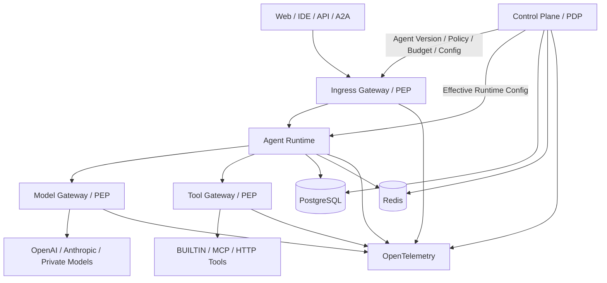
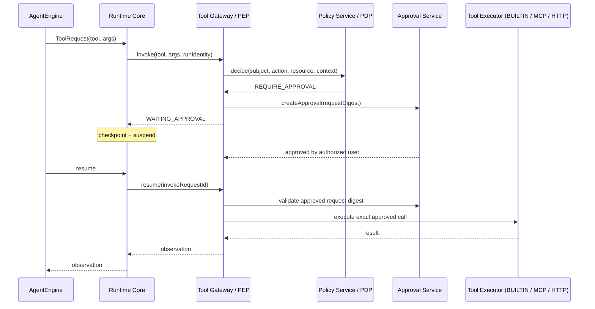

# Architecture — Control Plane + Data Plane + 3 Gateways

## 1. 架构结论

v1 使用：**模块化单体 Control Plane + 独立 Agent Runtime（TypeScript Runtime Core + 可插拔 Agent Engine）+ 逻辑三网关 + 共享基础设施**。

不要在 MVP 阶段拆成十几个微服务。先稳定边界与契约，再按负载、团队和安全边界拆分。



## 2. Control Plane 与 Data Plane

### Control Plane
负责“定义允许发生什么”：
- Workspace / Team / Identity / Membership
- Agent Registry / Version（Personal Agent + Agent Template）
- Skill Registry（Skill / SkillVersion / SkillCategory / AgentSkillBinding）
- Model Policy
- Tool Registry / Tool Provider / Tool Policy
- Policy Decision
- Budget
- Approval
- Release / Rollback
- Audit Configuration

### Data Plane
负责“真正执行任务”：
- Ingress enforcement
- Session / Run
- Conversation / Task（user-work 执行状态，见 USER_AND_RESOURCE_MODEL.md §7）
- Context
- Agent Loop（由 AgentEngine 提供，framework-specific）
- Workflow / DAG
- Model Call
- Tool Call
- Checkpoint
- Runtime Event Stream

关键约束：Data Plane 可以读取有效策略并请求决策，但不能修改策略本身。Conversation / Task 属于 Data Plane user-work 执行状态，不是治理型 Control Plane Domain；其公共 API 仍通过 Ingress 暴露。

## 3. 3 Gateways

### 3.1 Ingress Gateway
职责：认证、Workspace / User / Agent Identity、Rate Limit、请求 Scope、A2A 校验。

MVP 可以作为 Spring Boot Control Plane 的 API 入口模块实现；未来再单独拆 Spring Cloud Gateway / Envoy。

### 3.2 Model Gateway
职责：
- 逻辑模型 → Provider Route
- API Credential Isolation
- Budget Enforcement
- Token Limit
- Timeout / Retry / Fallback
- Usage metering

重要：业务 Agent 代码与 AgentEngine 都不得直接调用 Provider SDK；Model Call 由 Runtime Core 经 Model Gateway 执行。

### 3.3 Tool Gateway
职责：
- Tool lookup（ToolDefinition / ToolVersion）
- schema validation
- scope check
- policy enforcement
- approval binding
- executor dispatch（BUILTIN / MCP / HTTP）
- timeout / retry policy
- execution audit

所有 Tool——Built-in Tool 与 MCP Tool——都必须经过 Tool Gateway；所有会产生外部副作用的工具优先纳入 Tool Gateway。

## 4. PDP / PEP

```text
Agent requests action
        ↓
PEP (Gateway)
        ↓
Policy Decision Request
        ↓
PDP (Control Plane)
        ↓
ALLOW | DENY | REQUIRE_APPROVAL
        ↓
PEP 强制执行
```

PDP 负责“决定”；PEP 负责“不可绕过地执行决定”。

## 5. MVP 部署单元

```text
/apps/web-console
/services/control-plane
/services/agent-runtime
/infra/docker-compose
```

Control Plane 内部按领域模块组织，而不是物理微服务。

### 5.1 Agent Runtime：Runtime Core + 可插拔 Agent Engine

Agent Runtime 使用 **TypeScript Runtime Core + Pluggable Agent Engine Architecture**。Runtime Core 不依赖任何具体 Agent Framework。

```text
Runtime Core
↓
AgentEngineRegistry
↓
AgentEngine
├── PiEngine          # MVP 默认实现
├── LangGraphEngine   # future
└── NativeEngine      # future
```

Runtime Core 拥有：Run、Session、Agent Version Snapshot、State Machine、Checkpoint metadata、Tool Gateway、Model Gateway、Policy enforcement integration、Approval integration、Budget、Audit / Runtime Events。

AgentEngine 只负责 framework-specific 部分：Agent Loop、Context execution、Prompt execution、framework state、Tool Call / Model Call 生成。**Pi 只是 AgentEngine 的第一种实现，不是 Runtime Core 本身。**

Runtime 内部目录（Conversation / Task 与 Core / Engines 同属 agent-runtime，不新增部署服务）：

```text
runtime/
├── conversation/      # Conversation Runtime：普通对话链路（不启动 AgentEngine）
├── task/              # Task → Run 编排：Task 固定 AgentVersion、新指令新 Run
├── core/
│   ├── session
│   ├── run
│   ├── state-machine
│   ├── checkpoint
│   ├── model-gateway
│   ├── tool-gateway
│   └── event-stream
└── engines/
    ├── registry        # AgentEngineRegistry
    └── pi/             # PiEngine（唯一允许依赖 Pi SDK 的模块）
```

接口定义见 RUNTIME_CONTRACTS.md §10；能力组成见 AGENT_CAPABILITY_MODEL.md。

### 5.2 Conversation Path（普通对话执行链）

普通 Conversation 不绑定 Agent，不经过 AgentEngine / Tool Gateway：

```text
Employee
↓
Conversation
↓
Ingress
↓
Conversation Runtime（runtime/conversation 模块）
↓
Model Gateway
↓
LLM
↓
ConversationMessage
```

- Conversation 必须经 Model Gateway，**禁止直接调用 Provider SDK**。
- `/skill` 导入的 Skill 绑定 exact SkillVersion，只注入上下文，不产生 Tool 权限。
- Agent Task 路径（Task → Run → Runtime Core → AgentEngine）与该链路相互独立，共享 Model Gateway / 事件流 / 可观测性基础设施。

## 6. 受控状态迁移

Run 状态：

```text
CREATED
  ↓
RUNNING
  ├─→ WAITING_APPROVAL ─→ RUNNING
  ├─→ PAUSED ──────────→ RUNNING
  ├─→ FAILED
  ├─→ CANCELLED
  └─→ COMPLETED
```

Runtime 不允许任意写 `status`；必须调用状态机命令，例如：
- startRun
- requestApproval
- resumeAfterApproval
- failRun
- completeRun
- cancelRun

每个命令验证合法前态。

注意：Run 状态机只属于执行实例。Agent 的产品状态是 `ENABLED | DISABLED`（可用 / 已停用），Task 的产品状态是 `ACTIVE | ARCHIVED`；三者不要混用（见 USER_AND_RESOURCE_MODEL.md §5.4、§7）。

## 7. 一次 Tool Call 的完整链路



审批绑定的是**确切 Action Request**，而不是泛化的“这个 Agent 已获批准”。如果参数变化，必须重新决策。Built-in Tool 与 MCP Tool 走完全相同的链路。

## 8. 数据一致性

### 强一致对象
- Agent Version publish
- Approval status
- Budget reservation / consume
- Release active version
- Run state transition

优先使用 PostgreSQL 事务。

### 最终一致对象
- Metrics
- Search index
- Aggregated usage dashboard
- Long-term analytics

使用 Outbox / background jobs 异步处理。

## 9. 事件模型

核心事件：
- AgentCreated / AgentVersionPublished
- TaskCreated / TaskArchived
- RunCreated / RunStarted
- ConversationCreated / ConversationMessageCompleted
- ModelCallCompleted
- ToolCallRequested
- PolicyDecisionMade
- ApprovalRequested / ApprovalResolved
- ToolCallCompleted
- RunCompleted / RunFailed
- ReleaseActivated / RolledBack

Conversation 驱动与 Task / Run 驱动的事件复用同一 Event Stream 基础设施；MVP 不要求 Kafka，先用 Postgres Outbox + worker。

## 10. 安全边界

- Provider API Key 只存在于 Model Gateway secret storage。
- Tool credentials 只存在于 Tool Gateway / Connector secret storage。
- Runtime 获取的是 credential reference，而不是 secret 明文。
- Approval token 不进入 Prompt。
- Prompt 中 `approval=true`、`admin=true` 等内容没有任何授权意义；Policy evaluation input 中不接受 Agent 自报角色作为可信身份。
- 每次 Tool Call 使用服务器注入的 `agentId/userId/workspaceId/runId/versionId`。
- Agent 永远只能请求动作；Built-in Tool 与 MCP Tool 都必须经过 Tool Gateway（见 AGENT_CAPABILITY_MODEL.md §5、§8）。
- bash 不能成为权限逃生通道：若 `git.push` 需要 REQUIRE_APPROVAL，则不能通过 `bash("git push ...")` 绕开审批。shell executor 至少受 workspace sandbox、command policy、filesystem scope、network policy、environment / secret isolation 控制。

## 11. 未来拆分条件

只有出现下列情况才拆微服务：
- Model Gateway QPS 与 Runtime 明显不同。
- Tool Gateway 需要独立网络安全域。
- Approval / Policy 需要独立高可用和团队 ownership。
- Control Plane 单体发布频率成为瓶颈。
- 数据归属要求服务级隔离。

在此之前，保持模块化单体更容易保证事务和迭代速度。
