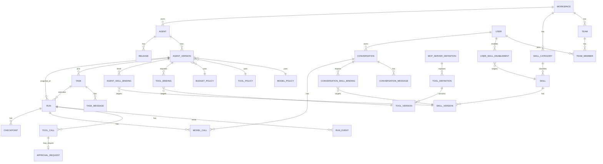

# Data Model — MVP

## 1. 原则

- PostgreSQL 是控制状态的事实源。
- Redis 只存短期缓存、锁、SSE fanout 等可重建数据。
- Published Version、Approval、Run State、Budget 不能只存在 Redis。
- 使用 UUID / UUIDv7 或 ULID 作为全局 ID。
- Conversation / Task 及其消息、绑定属于 Data Plane user-work 执行状态（归属 agent-runtime 域），与治理型 Control Plane 表同库不同域；不放入 Control Plane 治理 Domain（见 CONTROL_PLANE_DOMAINS.md §2）。
- 资源 Scope 统一枚举：`WORKSPACE | TEAM | PERSONAL`（不使用 PLATFORM，见 USER_AND_RESOURCE_MODEL.md §2）。

## 2. 核心关系

## 3. 主要表

### workspace
- id
- name
- status
- created_at

### team
- id
- workspace_id
- name
- description
- status
- created_at / updated_at

唯一约束：`(workspace_id, name)`。

### team_member
- id
- workspace_id
- team_id
- user_id
- role（TEAM_ADMIN | TEAM_BUILDER | MEMBER）
- created_at

唯一约束：`(team_id, user_id)`。

> Identity 侧的 user / membership / rolebinding（Workspace 级 WORKSPACE_ADMIN / AUDITOR / OPERATOR / EMPLOYEE）沿用 identity Domain 设计，此处不重复展开。

### agent
- id
- workspace_id
- kind（PERSONAL | TEMPLATE）
- scope（WORKSPACE | TEAM | PERSONAL）
- owner_user_id（kind = PERSONAL 时 NOT NULL）
- team_id（scope = TEAM 时 NOT NULL；scope = WORKSPACE 时为空）
- source_template_version_id（Clone 来源：模板的 Published AgentVersion；仅来源追踪，不建立实时继承）
- name
- description
- status（ENABLED | DISABLED；不是 RUNNING / STOPPED）
- current_published_version_id
- created_at / updated_at

约束：
- `kind = PERSONAL` → `scope = PERSONAL` 且 `owner_user_id NOT NULL`。
- `kind = TEMPLATE AND scope = WORKSPACE` → `team_id` 为空（Workspace Template，Workspace Admin 管理）。
- `kind = TEMPLATE AND scope = TEAM` → `team_id NOT NULL`（Team Template）。

### agent_version
- id
- agent_id
- version_number
- state
- manifest_json（Agent Version Manifest：engine / modelPolicy / skills（exact SkillVersion）/ tools（exact ToolVersion），见 AGENT_CAPABILITY_MODEL.md §7）
- engine_json（engine.type + config，冗余存储用于查询）
- model_policy_id
- tool_policy_id
- budget_policy_id
- approval_policy_id
- checksum
- published_at
- created_at

唯一约束：`(agent_id, version_number)`。skills / tools 的绑定同时落在 agent_skill_binding / tool_binding 表，manifest_json 是发布时的冻结序列化。

### agent_skill_binding
- id
- agent_version_id
- skill_version_id
- created_at

唯一约束：`(agent_version_id, skill_version_id)`。绑定 exact SkillVersion；源 Skill 后续更新不影响已 Published 的 AgentVersion。

### model_policy
- id
- workspace_id
- name
- config_json
- created_at / updated_at

### skill_category
- id
- workspace_id
- name
- description
- icon
- sort_order
- status
- created_at

唯一约束：`(workspace_id, name)`。由 Workspace Admin 创建；普通用户不能创建 Category。

### skill
- id
- workspace_id
- scope（WORKSPACE | TEAM | PERSONAL）
- team_id（scope = TEAM 时 NOT NULL）
- owner_user_id（scope = PERSONAL 时 NOT NULL）
- category_id（NOT NULL，FK → skill_category）
- source_skill_version_id（Clone 来源：源 Skill 的 Published SkillVersion；仅来源追踪，不建立实时继承）
- name
- description
- status（ENABLED | DISABLED）
- current_published_version_id
- created_at / updated_at

唯一约束：`(workspace_id, scope, name)`（同 scope 内不重名）。约束规则与 agent 一致（TEAM → team_id 必填、PERSONAL → owner_user_id 必填）。

### skill_version
- id
- skill_id
- version_number
- instructions
- references_json
- checksum
- state（DRAFT | PUBLISHED | DEPRECATED）
- published_at
- created_at

唯一约束：`(skill_id, version_number)`。Published SkillVersion immutable；更新走新版本。

### user_skill_enablement
- id
- workspace_id
- user_id
- skill_id
- enabled
- updated_at

唯一约束：`(user_id, skill_id)`。用户个人偏好，不改变 Skill 本身状态。

### tool_definition
- id
- workspace_id
- name（如 `builtin.read`、`github.create_pull_request`）
- provider（BUILTIN | MCP | HTTP，预留 future providers）
- provider_ref（BUILTIN 为空 / mcp_server_id / HTTP connector ref）
- risk_level
- capability_tags_json
- status
- created_at / updated_at

ToolDefinition 只承载工具身份（identity）；input schema 属于 ToolVersion（不可变执行契约），不在 identity 表上。`builtin.*` Tool 由 Runtime 注册（provider = BUILTIN）；MCP Tool 由 `tools/list` 同步产生（provider = MCP）。

### tool_version
- id
- tool_definition_id
- version
- input_schema_json
- checksum
- created_at

### tool_binding
- id
- agent_version_id
- tool_version_id
- created_at

唯一约束：`(agent_version_id, tool_version_id)`。Binding 绑定 exact ToolVersion，只表示“可请求”，执行仍需 Policy 决策。语义不回退（v1.1.1 冻结）。

### mcp_server_definition
- id
- workspace_id
- name
- transport_json（stdio command / http url）
- credential_ref
- status
- last_synced_at

### tool_policy
- id
- workspace_id
- name
- rule_json

### policy_rule
- id
- workspace_id
- name
- priority
- effect
- subject_selector_json
- action_selector_json
- resource_selector_json
- condition_json
- enabled

### conversation
- id
- workspace_id
- owner_user_id
- title
- summary
- default_model_policy_id（默认模型；候选来自用户 Effective Capability）
- status（ACTIVE | ARCHIVED）
- created_at / updated_at

Index：`(workspace_id, owner_user_id, updated_at desc)`。

Conversation 属于 Data Plane user-work 执行状态；不绑定 Agent，不产生 Run。

### conversation_message
- id
- conversation_id
- role（USER | ASSISTANT | SYSTEM）
- content / content_ref
- metadata_json（实际 modelPolicy / provider / model / usage 摘要引用等）
- created_at

### conversation_skill_binding
- id
- conversation_id
- skill_version_id
- added_by
- created_at

唯一约束：`(conversation_id, skill_version_id)`。绑定 exact SkillVersion；添加 / 移除不重写历史消息；源 Skill 更新不改变已绑定版本。

### task
- id
- workspace_id
- owner_user_id
- agent_id（MVP：创建时固定 1 个 Personal Agent）
- agent_version_id（NOT NULL，创建时固定的 exact Published AgentVersion；创建后不可变，不自动跟随新版本，不可通过消息 API 修改——见 API_CONTRACTS.md §5）
- title
- summary
- status（ACTIVE | ARCHIVED；产品生命周期，不复制 Run 状态机，无 TASK_RUNNING / TASK_WAITING_APPROVAL）
- created_at / updated_at

Index：`(workspace_id, owner_user_id, updated_at desc)`。

### task_message
- id
- task_id
- role（USER | ASSISTANT | SYSTEM）
- content / content_ref
- run_id（该消息所属 / 产生的 Run；用户指令消息可先为空）
- created_at

### run
- id
- workspace_id
- task_id（Employee 产品面创建的 Run 必填；为空的 Run 仅保留给平台内部 / 管理性执行）
- agent_id
- agent_version_id
- subject_type / subject_id
- status
- input_json / input_ref
- current_checkpoint_id
- started_at / finished_at
- failure_code
- trace_id

Index：`(workspace_id, created_at desc)`、`(agent_id, created_at desc)`、`(task_id, created_at desc)`、`status`。

执行规则（冻结）：Task 新指令 → 新 Run；Approval / Pause Resume → 同一个 Run（见 RUNTIME_CONTRACTS.md §3b）。

### checkpoint
- id
- run_id
- sequence_no
- state_ref / state_json
- pending_action_json
- created_at

### model_call
- id
- run_id（可空）
- conversation_id（可空）
- step_id
- model_policy_id
- provider
- model
- status
- input_tokens
- output_tokens
- cost_amount
- latency_ms
- trace_span_id
- created_at

约束：`CHECK ((run_id IS NOT NULL AND conversation_id IS NULL) OR (run_id IS NULL AND conversation_id IS NOT NULL))` —— exactly one execution owner。Run 驱动与 Conversation 驱动的 Model Call 共用这一张表与 usage 体系，不复制两套系统；不破坏现有 Run Model Call 语义。

### tool_call
- id
- workspace_id
- run_id
- step_id
- tool_version_id
- normalized_arguments_json
- arguments_digest
- status
- policy_decision_id
- idempotency_key
- result_ref / result_summary_json
- created_at / completed_at

唯一约束建议：`(workspace_id, tool_version_id, idempotency_key)`。tool_call 引用 exact ToolVersion，保证历史 Run 可重放与审计一致。

### policy_decision
- id
- workspace_id
- subject_json
- action
- resource_json
- context_digest
- result
- matched_rule_ids_json
- reason_code
- created_at

### approval_request
- id
- workspace_id
- run_id
- tool_call_id
- request_digest
- status
- required_scope
- expires_at
- resolved_by
- resolved_at
- resolution_reason

Approval Resume 恢复原 Run（run_id 不变，不新建 Run）。

### budget_policy
- id
- workspace_id
- name
- max_tokens_per_run
- max_cost_per_run
- max_tokens_per_day_per_agent

### budget_usage
- id
- workspace_id
- agent_id
- run_id
- conversation_id（可空；Conversation 驱动的 usage 归集）
- usage_type
- amount
- window_key
- created_at

### release
- id
- agent_id
- agent_version_id
- action
- created_by
- created_at

### audit_log
- id
- workspace_id
- actor_json
- operation
- resource_type
- resource_id
- result
- correlation_id
- metadata_json
- created_at

Audit 按时间追加，不做业务级 update。

## 4. Outbox

`outbox_event`：
- id
- aggregate_type
- aggregate_id
- event_type
- payload_json
- created_at
- published_at
- attempts

同一事务写业务状态与 Outbox，避免“DB 成功但事件丢失”。
